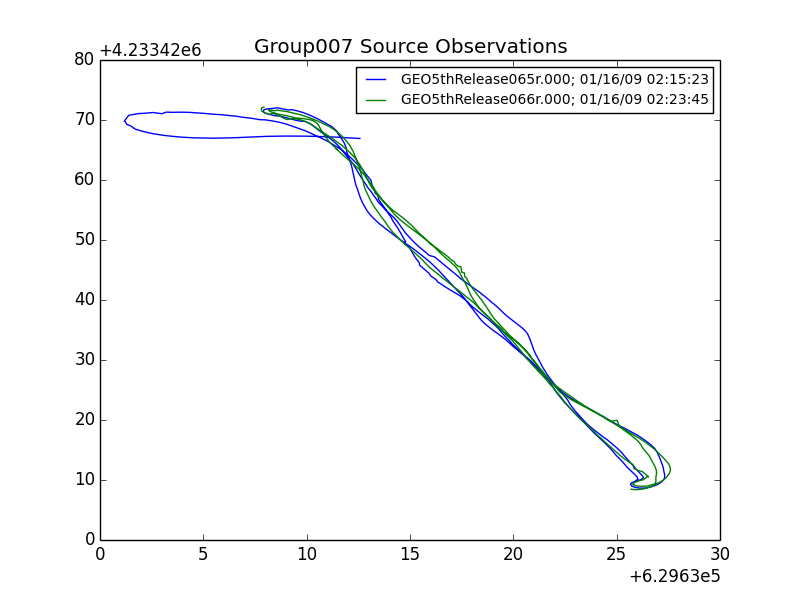
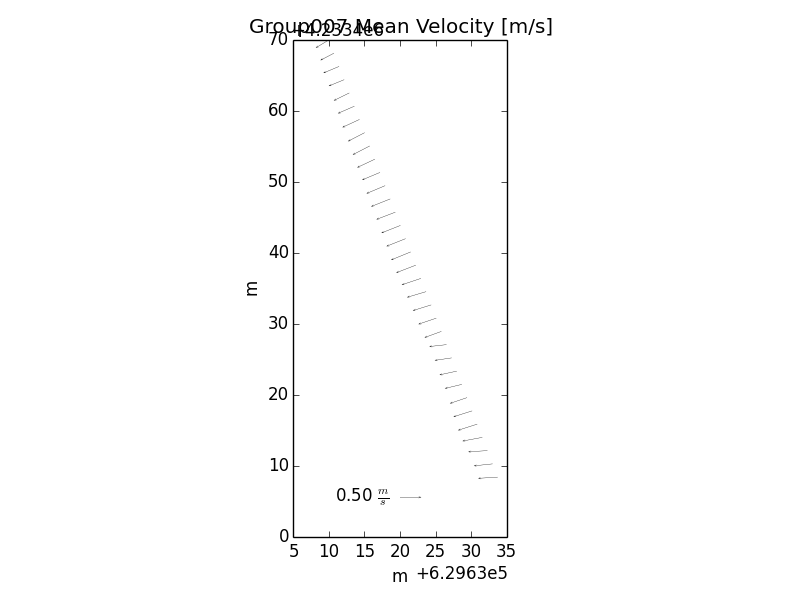
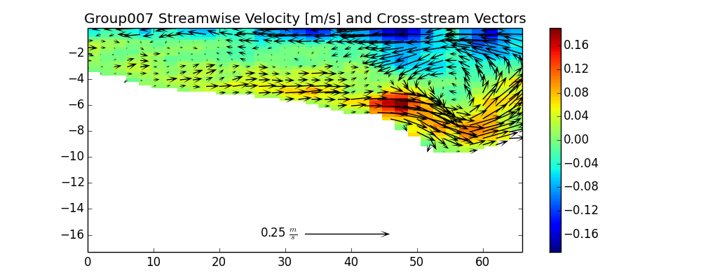
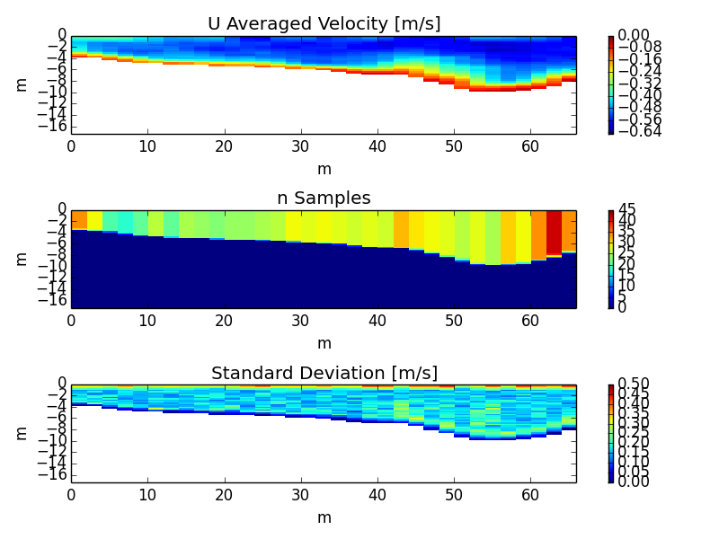
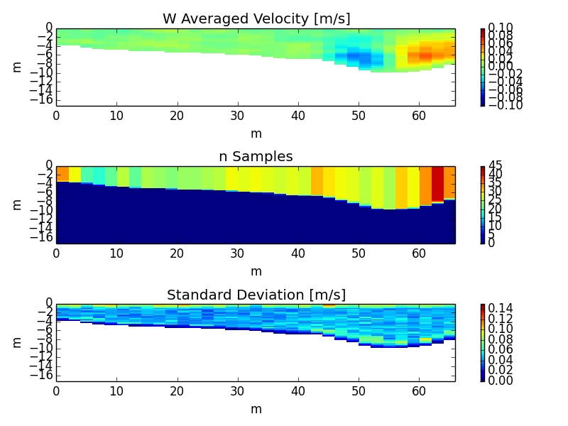

=============================
Scripting Examples with ADCPy
=============================

Open, processing and visualizing a raw file
-------------------------------------------
ADCPy is constructed to allow a high level of control and tuning over processing of large and varied datasets, however processing can be accomplished easily. For example, as a first pass to visualize data, a short sequence of commands can open, pre-process, and visualize a raw ADCP data file:

1. Import ADCPy to your python session, and open a raw file named ‘example.r000’::

    import ADCPy
    adcp = ADCPy.open_file(‘example.r000’,file_type=’ADCP_RdiWorkhorse_Data’)

2. Perform some data processing steps including dropping outliers based on standard deviation, smoothing using a boxcar filter, and re-projecting to a regular 2m horizontal by 0.3 m vertical grid::

    adcp.sd_drop(sd=3)    # drop velocities showing a high standard deviation
    adcp.kernel_smooth(kernel_size=3)  # boxcar filter to smooth velocities
    adcp.xy_regrid(dxy=2.0, dz=0.3, xy_srs='EPSG:26910') 

3. Rotate and plot a U,V and W velocities as images::

    import ADCPy_recipes
    adcp = ADCPy_recipes.transect_rotate(adcp,’principal flow’)
    fig = ADCPy.plot.plot_UVW_velocity_array(adcp.velocity)

4. Save data to disk::

    adcp.write_nc(‘example_processed.nc’,zlib=True)  

For further descriptions of ADCPy functionality, see the ADCPy Function Reference.

Batch processing and secondary circulation
------------------------------------------

Our first "industrial strength" example is the script transect_average.py. This script is actually used in our production work to 
sort through ADCP transects, find ones that are appropriate for averaging, projecting, rotating and visualizing them.

Basic Usage
^^^^^^^^^^^

    1.	Set the options in the transect_average.py script by opening it with a text editor, and changing the parameters listed near the top of the file (See transect_average.py options below for reference).
    
    2.	Edit the transect_preprocessor_input.py file in a text editor, paying attention to the file requirements (i.e. Python conventions: only spaces [no tabs], and no white space in front the parameter lines).
    
        a.	Assign the working_directory to the path containing your raw (*.r.000, *.nc) files 
        b.	Review the processing options section of the file, and change if needed
        c.	Enable/disable netcdf file output as desired
        d.	Save changes to adcp_processor_input.py
        
    3.	Run the transect_average.py script file using your installed Python distribution.  There are many ways to run the python script – here are three useful ones: 
    
        a.	Open a command window (cmd.exe on Windows); change to the adcp_python directory (cd <path to ADCPy>); type “python transect_average.py”.
        b.	In an already –running python session, at the prompt type “execfile(‘<path>/transect_average.py’)”.
        c.	Begin a Spyder session (if you have elected to install Spyder).  Choose “File:Open…” from the program menus, and open adcp_processor.py.  Then Choose “Run“ from the program menu, or press function key F5.
        
    4.	The script will output various text progress messages, warnings, figures, or errors during operation.  Script output will be located inside a folder named “ADCPy” that will be created inside the working_directory specified in the transect_preprocessor_input.py file .

Options  
^^^^^^^

At present, options are written directly at the top of the script.

==============================  ==================
Option                          Description
==============================  ==================
avg_dxy	                        Horizontal resolution of averaging bins {m}.
avg_dz	                        Vertical resolution of averaging bins [m].
avg_max_gap_m	                Maximum distance allowed between ADCP observations when averaging [m ].
avg_max_gap_minutes             Maximum time allowed between ADCP observations when averaging[minutes].
avg_max_group_size              The maximum number of ADCP observations to average.
avg_rotation	                One of {'Rozovski','no transverse flow', 'principal flow', 'normal', None} or alternatively can be a scalar in radians to specify a rotation angle .
avg_std_drop	                The number of calculated standard deviations away from the mean velocity, above beyond which velocity samples are dropped from analysis. {0.0=no dropping, 2.0-3.0 typically [number of standard deviations ]}.
avg_std_interp	                Switch to perform interpolation of holes in velocity profiles left by high standard deviation removal {typically True with std_drop > 0.0}.
avg_smooth_kernel               Remove noise from ADCP velocities through smoothing data using a square-kernel boxcar-filter.  The square filter average neighboring velocities in a square pattern (kernel), with the sidelength of the square = smooth_kernel (i.e. smooth_kernel=3 specifies a 3x3 square, effectively averaging the 9 neighboring velocities). {0 for no smoothing, or odd integer between 3-9 }.
avg_save_netcdf                 True = Save bin-averaged velocities as an ADCP_Data netcdf file.
avg_save_csv	                True = Save bin-averaged velocities as a CSV text file.
avg_plot_xy                     True = Generate a composite plot of survey location(s) of original ADCP ensembles.
avg_plot_avg_n_sd               True = Generate pcolor plots of bin-averaged uv,w velocities, and the number and standard deviation of bin averages.
avg_plot_mean_vectors           True = Generate an arrow plot of bin-averaged U-V mean velocities in the x-y plane.
avg_plot_secondary_circulation  True = Generate an image plot of 2D bin-averaged streamwise (u) velocities, overlain by an arrow plot showing secondary circulation in the y-z plane.
avg_plot_uvw_velocity_array     True = Generate a 3-panel image plot showing bin-averaged U,V,W velocities in the y-z plane.
avg_plot_flow_summmary          True = Generate a summary plot showing image plots of U,V bin-averaged velocities, an arrow plot of bin-averaged U-V mean velocities, and flow/discharge calculations.
avg_save_plots                  True = Save generated plots to disk as .PNG files.
avg_show_plots                  True = Print plots to screen (pauses execution until plots are manually closed).
==============================  ==================

A tutorial example
^^^^^^^^^^^^^^^^^^

As an example analysis we use the transect_average.py script to average multiple ADCP transects from different locations.  In order to increase the signal-to-noise ratio in the data, we will instruct the transect_average.py to average transects close in space and time, such that final gridded velocity profiles have a better chance at resolving secondary circulation features.  Below we describe inline the steps required to produce this analysis.

The USGS ADCP data used for this analysis comes from repeated transect sampling at Walnut Grove on the Sacramento/San Joaquin delta, on 16 January, 2009. In this series of observations, the ADCP traversed the width of the channel three times.  The total survey consisted of 54 raw RDI WinRiver data files from several locations, with gaps ranging from 2 – 35 minutes.  

Step 1:
"""""""
Locate the path to the data files, and set working_directory parameter in the pre-processor input file (transect_preprocessor_input.py) to this path.  In our case, the link from the input file looks like this::

    working_directory = r'C:\adcp_anaylsis_stations\GEO20090116'

The small ‘r’ in front of the single quote is required – this ‘r’ sets the interpretation of the path as literal (i.e. no special characters [like \t = tab] are inferred).  
 
Step 2:  
"""""""
Set the processing parameters to these suggested default settings in the input file (adcp_processor_input.py)::

xy_projection = 'EPSG:26910'
do_headCorrect = False
headCorrect_spanning = False
mag_declination = 14.7
u_min_bt = 0.3
hdg_bin_size = 5 
hdg_bin_min_samples = 10
sidelobe_drop = 0.1
std_drop = 3.0
std_interp = True
smooth_kernel = 0
smooth_interp = True
average_ens = 1
regrid_horiz_m = None
regrid_vert_m = None
adcp_depth = 0.10
average_ens = 10
p1lat = None
p1lon = None
p2lat = None
p2lon = None

In this case, we instruct transect_preprocessor.py to perform a minimum of processing, so that most of the raw ADCP velocities can be used in bin-averaging.  We have used sidelobe_drop = 0.1 and std_drop = 3.0 to remove bottom interference and outliers before averaging.  transect_preprocessor.py will return a python list of ADCP_Data objects containing the ADCP observation data in the working_directory.

Step 3:
"""""""
Check the options in the transect_average.py file.  We have set the options as follows::

    avg_dxy = 1.0
    avg_dz = 0.25 
    avg_max_gap_m = 30.0
    avg_max_gap_minutes = 60.0
    avg_max_group_size = 6 
    avg_rotation = 'Rozovski' 
    avg_std_drop = 3.0
    avg_std_interp = True 
    avg_smooth_kernel = 3
    avg_save_netcdf = True 
    avg_save_csv = True 
    avg_plot_xy = True 
    avg_plot_avg_n_sd = True 
    avg_plot_mean_vectors = True 
    avg_plot_secondary_circulation = True 
    avg_plot_UVW_velocity_array = True 
    avg_plot_flow_summmary = True 
    avg_save_plots = True 
    avg_show_plots = False

These options will average velocities from ADCP_Data objects that are within 30 m and 60 minutes of each other.  The resulting velocities are projected onto a 1.0 x 0.25 m regular grid, whose x-y orientation is fitted from the locations of input ensembles.  The velocity data will be further cleaned (std_drop) and smoothed (kernel_smooth), rotated (Rozovski method), and the full array of output data formats and plots for each grouping of transects will be written to disk.

Step 4:
"""""""
Run the transect_average.py script.
E.g. type ‘python transect_average.py’ from an appropriate directory in the command windows to start the processing.

During preprocessing, each individual raw file will be read into an ADCP_Data object.  Output from this activity shows the full path of the raw files::

    Processing data_file: Y:\temp\ADCP_2008\NDSOS_DLADCP.VelocityData\5thRelease\GEO5thRelease\GEO20090116\ADCPy\GEO5thRelease055r
    No fitted heading correction found - performing single magnetic declination correction
    Processing data_file: Y:\temp\ADCP_2008\NDSOS_DLADCP.VelocityData\5thRelease\GEO5thRelease\GEO20090116\ADCPy\GEO5thRelease056r
    No fitted heading correction found - performing single magnetic declination correction
    Processing data_file: Y:\temp\ADCP_2008\NDSOS_DLADCP.VelocityData\5thRelease\GEO5thRelease\GEO20090116\ADCPy\GEO5thRelease057r
    …

After the ADCP_Data objects are generated, preprocessed, and passed back to the main transect_average.py script, the groupings of the ADCP_Data objects are determined.  ADCP_Data objects are first grouped by space (space groups), then these groups are further split by time (spacetime groups).  In general we observe from the displayed messages that most often we arrive at just two ADCP_Data objects per group for averaging.  Recall that for this survey, three complete transects are containing in each observation, so in reality we will be averaging six transects across the channel::

    space group 0 -  1 observations
    space group 1 -  4 observations
    space group 2 -  4 observations
    space group 3 -  3 observations
    spacetime group 0 -  1 observations
    spacetime group 1 -  2 observations
    spacetime group 2 -  2 observations
    spacetime group 3 -  2 observations
    spacetime group 4 -  2 observations
    spacetime group 5 -  2 observations

Finally each group is averaged, cleaned, and outputs are saved.  

Outputs
"""""""

.. image:: image/group007_Flow_Summary.png

    